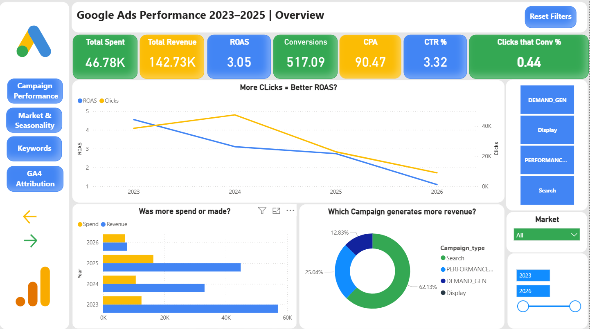

# Google_ADS_analysis
# Google Ads Performance Analysis — Inspira Hotels (2023–2025)

**Tools:** SQL · Power BI · DAX · Google Analytics 4  
**Data:** Anonymized with employer approval | Two Lisbon boutique hotel properties  
**Status:** Complete

---

## Overview

This project analyzes three years of Google Ads campaign data for a two-property boutique hotel group in Lisbon, cross-referenced with GA4 attribution data. The goal was to identify where budget was being wasted, which markets and campaigns were actually profitable, and what the data revealed about customer acquisition behavior.

The analysis covers €39,566 in total ad spend across 2023–2025 and produces a set of concrete, evidence-based recommendations for budget reallocation.

**The core finding:** Search campaigns work. Every other campaign type — Demand Gen, Performance Max, Display, Brand Awareness — generated near-zero returns while consuming over 30% of the total budget.

---

## Dashboard

The Power BI report is structured across five pages. Each section below corresponds to one dashboard page.

---

### 1. Overview

**Key metrics at a glance:**

| Metric | Value |
|---|---|
| Total Spend | €39,566 |
| Total Revenue | €20,935 |
| Overall ROAS | 0.53 |
| Total Conversions | 506 |
| CPA | €78.19 |
| CTR | 4.04% |
| Conversion Rate | 0.46% |

The account has been loss-making across the entire three-year period. However the trajectory is improving: 2025 ROAS reached 0.79, up from 0.35 in 2023, driven by campaign reduction and budget concentration into Search.

**Critical observation:** 2024 had the highest click volume of any year but the worst ROAS. More clicks did not produce more revenue. The account needed to optimize for conversions, not traffic.

---

### 2. Campaign Performance

Campaign type breakdown exposes the structural budget misallocation at the core of the account:

| Campaign Type | Total Spend | Total Revenue | ROAS |
|---|---|---|---|
| Search | €27,660 | €20,935 | 0.76 |
| Performance Max | €3,136 | €664 | 0.21 |
| Demand Gen | €7,534 | €21 | 0.003 |
| Display | €1,235 | €0 | 0.00 |

Demand Gen alone consumed €7,534 while producing €21 in revenue. Despite generating nearly 1.9 million impressions, it produced almost no clicks and virtually no conversions. The issue is not ad frequency — it is that these ads reached people with no purchase intent, and those people ignored them.

Search is the only campaign type that generates consistent revenue. All other campaign types are loss-making and represent budget that should be reallocated.

**Only 4 campaigns achieved positive ROAS across the entire three-year period — all in 2025.** This confirms that campaign optimization, not budget increases, drives performance improvement.

---

### 3. Market & Seasonality

Market performance reveals one critical misallocation: Spain delivers the highest ROAS in the account but receives among the smallest budget.

| Market | Total Spend | ROAS | Assessment |
|---|---|---|---|
| Spain | €592 | 4.53 | Critically underinvested |
| France / Belgium | €2,787 | 1.44 | Profitable |
| USA / Canada | €2,800 | 1.35 | Profitable |
| Portugal | €1,513 | 1.15 | Profitable |
| UK / Ireland | €6,292 | 0.92 | Loss-making — highest spend |
| Brazil | €2,400+ | 0.01 | Total waste |

UK/Ireland receives the largest budget allocation in the account and is the only major market delivering negative ROAS. Spain receives a fraction of that budget and returns 4.53x. This is the most actionable finding in the market analysis.

**Seasonality patterns:**

The heatmap reveals consistent, repeatable seasonal behavior across all markets:

- **Q1 is the universal peak** — strongest ROAS across all markets, particularly February
- **April–May collapse is structural** — all markets drop simultaneously regardless of campaign activity. This is a Lisbon demand pattern, not a campaign management failure
- **Spain peaks in Q1 and Q3** — should be targeted in January–February and July–August
- **France/Belgium peaks in Q4** — the only market that performs better in autumn than in spring
- **UK/Ireland and USA/Canada weaken sharply in Q2–Q3** — budgets should be reduced significantly in these quarters

---

### 4. Keywords

The keyword data reveals a fundamental dependency on branded search:

| Keyword Type | Keywords | Revenue | ROAS | Revenue Share |
|---|---|---|---|---|
| Branded | 30 | €44,005 | 2.94 | 94.87% |
| Non-Branded | 221 | €2,520 | 0.20 | 5.13% |

The account is almost entirely capturing people who already know the brand. 221 non-branded keywords across significant spend produce 5.13% of total revenue. Google Ads is functioning as a branded search defense mechanism, not a customer acquisition tool.

**Keyword concentration risk:**

- Top keyword alone: 43.58% of all keyword revenue
- Top 3 keywords combined: over 64% of all revenue
- Top 10 keywords: over 80% of all revenue

This concentration means the account is vulnerable to a single algorithmic change, a competitor bidding on brand terms, or a budget reduction.

**Match type performance:**

| Match Type | ROAS | Conv. Rate | CPA |
|---|---|---|---|
| Exact | 1.73 | 1.54% | €53 |
| Broad | 0.61 | 0.06% | €554 |

Broad match delivers 10x higher CPA than exact match. Expanding to broad match is not the solution to the non-branded keyword problem — it accelerates waste. The opportunity is in identifying high-intent non-branded exact match terms that describe specific hotel attributes: spa, design hotel, boutique, rooftop, breakfast included.

---

### 5. GA4 Attribution

GA4 attribution data places Google Ads performance in the context of the full acquisition picture:

| Channel | Revenue | Conversions | Ad Cost |
|---|---|---|---|
| Organic Search | €42,720 | 70 | €0 |
| Unassigned | €41,597 | 88 | — |
| Direct | €32,128 | 47 | €0 |
| Referral | €22,526 | 46 | €0 |
| Paid Search | €6,379 | — | €2,222 |
| Cross-network | €5,337 | — | €9,145 |

The two highest-revenue channels cost nothing in ad spend. Organic Search and Direct traffic — driven by brand awareness and SEO — outperform every paid channel by a significant margin.

**Paid Search ROAS in GA4 is 2.87**, considerably higher than what Google Ads reports internally. GA4 uses multi-touch attribution which credits Paid Search for assisted conversions that Google Ads last-click attribution misses. The true contribution of Search campaigns is likely higher than the platform dashboard shows.

**Customer journey analysis:**

The conversion path data shows that Inspira customers book with unusually high directness:

- 326 conversions via Single-touch Direct — the dominant path
- 212 conversions via Single-touch Organic Search
- 72 conversions via Single-touch Paid Search
- Multi-touch paths represent a minority of conversions

The majority of customers arrive with clear purchase intent and book in a single session. This behavior is consistent with a branded-search-dominant audience — people who already know the hotel and are actively looking to book. Awareness campaigns requiring multiple touchpoints before conversion are poorly suited to this audience.

**Brand Awareness campaign evaluation:**

Monthly GA4 data shows no measurable correlation between Brand Awareness spend and engaged session volume or revenue. Months with zero Brand Awareness spend performed comparably or better than months with active spend. Cross-network campaigns — which include Demand Gen and Display — do not appear in any of the top 20 conversion paths.

> **Caveat:** A definitive evaluation of Brand Awareness effectiveness requires Google Search Console branded query data, which was not available for this analysis. The absence of a visible correlation is not proof of zero effect — it is evidence that no effect is measurable with the current data.

**Tracking gap — Unassigned revenue:**

The Unassigned channel represents €41,597 in revenue with no identified source. This is the second-largest revenue category in GA4 and indicates a tracking implementation gap. Any attribution conclusions drawn from this dataset must be qualified by this limitation.

---

## Key Findings

1. **The account has never been profitable in aggregate.** Total spend of €39,566 against total revenue of €20,935 represents a cumulative loss across three years. The improvement trend in 2025 is real but the account has not reached breakeven.

2. **Over 30% of budget was allocated to campaigns producing near-zero revenue.** Demand Gen, Display, and Brand Awareness campaigns consumed significant budget while contributing almost nothing to conversion. Eliminating these campaigns and reallocating to Search is the single highest-impact action available.

3. **Spain is the most efficient market in the account and is critically underinvested.** ROAS 4.53 on €592 spend against UK/Ireland ROAS 0.92 on €6,292 spend represents the most significant budget misallocation in the account.

4. **The April–May performance collapse is seasonal demand, not campaign failure.** All markets drop simultaneously in the same weeks every year. Reducing budgets in this period and reallocating to Q1 and summer peaks would improve overall ROAS without any campaign changes.

5. **The non-branded keyword strategy is underperforming but the solution is not broad match expansion.** 221 non-branded keywords generate 5.13% of revenue. Broad match delivers 10x higher CPA than exact match. The problem is keyword selection, not match type — better non-branded exact match terms targeting specific hotel attributes represent the growth opportunity.

6. **Organic search and direct channels outperform every paid channel without ad spend.** The customers generating the most revenue already know the brand. This reinforces the importance of SEO and direct booking investment alongside paid acquisition.

---

## Data Limitations

- **GA4 conversion tracking was non-functional in 2023.** All 2023 attribution data shows zero conversions and has been excluded from GA4 analysis.
- **Brand Awareness effectiveness cannot be fully evaluated** without Google Search Console branded query volume data.
- **GA4 revenue covers both properties combined.** Property-level revenue attribution is not possible with this dataset.
- **The Unassigned GA4 channel (€41,597 revenue)** indicates tracking gaps that may be misattributing revenue from multiple sources.
- **Google Ads and GA4 use different attribution models.** ROAS figures from the two systems are not directly comparable.

---

## SQL Queries

The full SQL analysis is organized across five sections matching the dashboard structure:

- **Section 1 — Overall Performance:** Year-over-year trends, campaign type breakdown, quarterly performance, 2025 monthly trend
- **Section 2 — Campaign Performance:** Top campaigns by revenue, budget waste identification, conversion funnel, April/May collapse diagnosis, Q3 analysis
- **Section 3 — Market & Seasonality:** ROAS by market, quarterly heatmap construction, seasonal peak identification
- **Section 4 — Keywords:** Branded vs non-branded split, concentration risk, match type performance, zero-conversion keyword audit, branded search volume trend
- **Section 5 — GA4 Attribution:** Channel revenue and ROAS, multi-touch attribution paths, conversion complexity, traffic quality, non-Google campaign performance

Full SQL file: [`inspira_google_ads_analysis.sql`](inspira_google_ads_analysis.sql)

## About This Project

This analysis was conducted using anonymized data from a real hotel group. Brand names, property names, and identifying campaign details have been replaced with generic identifiers. All performance figures accurately reflect real campaign results.
