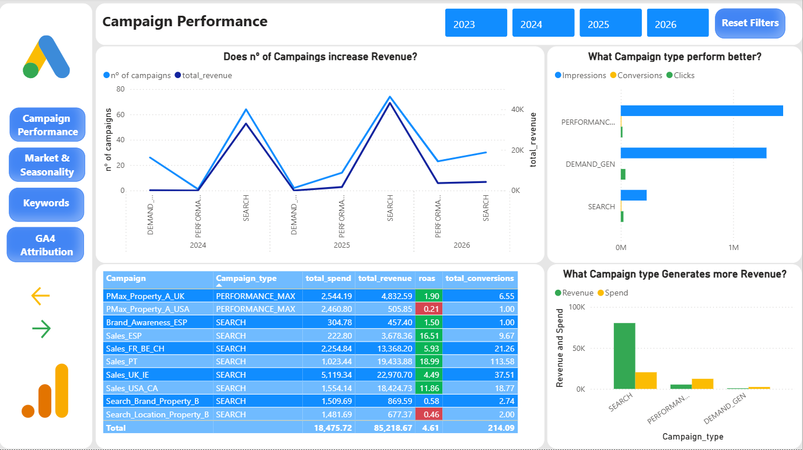
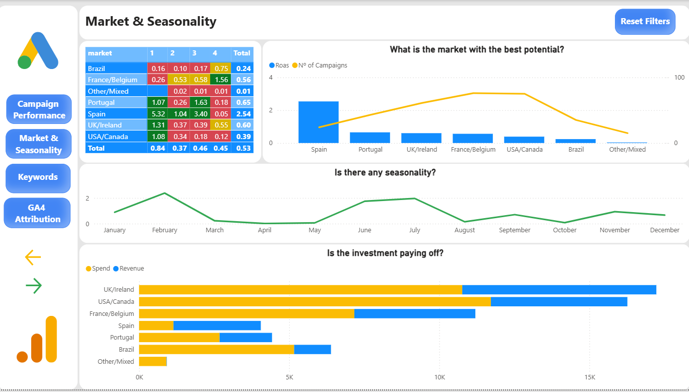
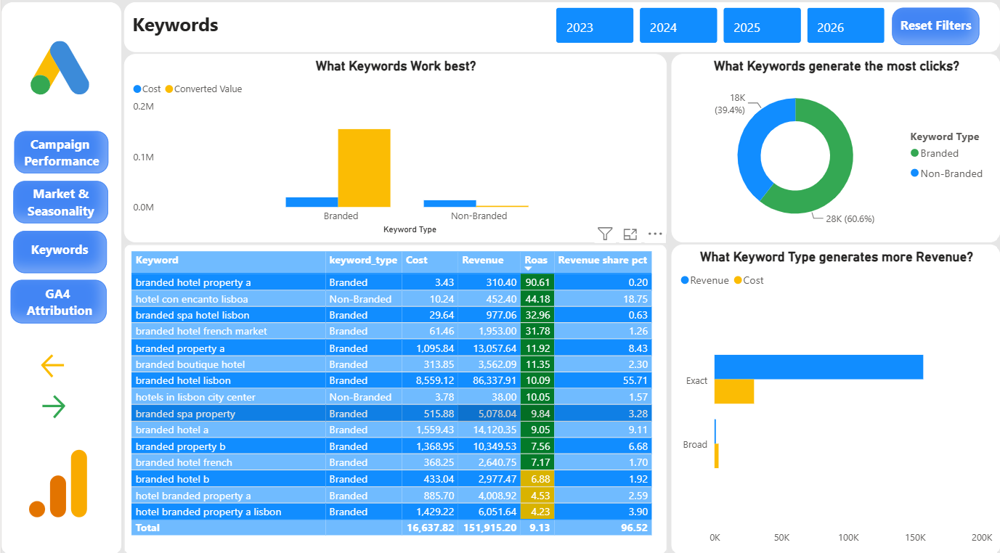
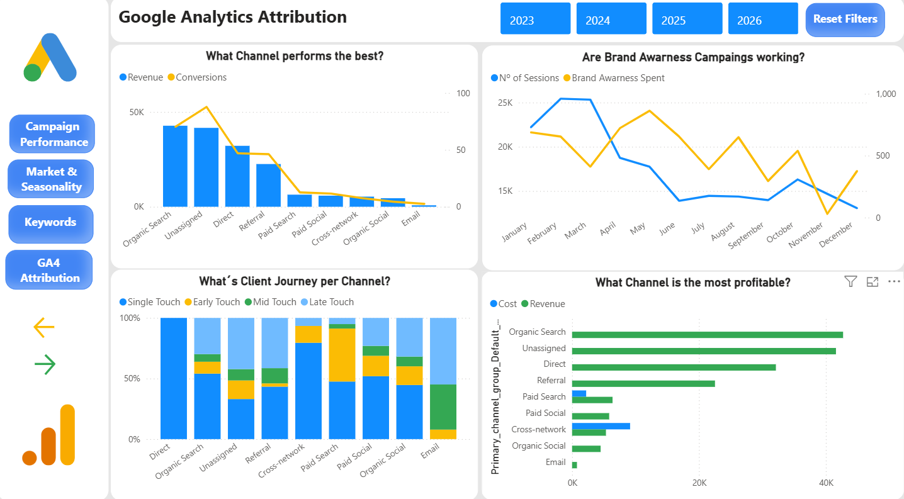

# Google Ads Performance Analysis — (2023–2025)

**Tools:** SQL · Power BI · DAX · Google Analytics 4  
**Data:** Anonymized with employer approval | Two hotel properties  
**Status:** Complete

---

## The Business Problem

A two-property boutique hotel group had been running Google Ads campaigns for three years with no clear picture of whether the investment was working. The questions being asked by management were straightforward:

- Are we making money from these campaigns?
- Are we improving over time?
- Why is our ROAS so low?
- Which campaigns should we focus on?
- Where should we adjust the budget?

This analysis covers €39,566 in total ad spend across 2023–2025, cross-referenced with GA4 attribution data, and answers each of these questions with evidence.

---

## Are the investments in campaigns paying off?

**Overall no, but the gap is closing.**

Across the full three-year period the account spent €39,566 and generated €20,935 in revenue. Every year total spend has exceeded total revenue. The account has never been profitable in aggregate.

| Year | ROAS | Assessment |
|---|---|---|
| 2023 | 0.35 | Severely loss-making |
| 2024 | 0.34 | No improvement despite more campaigns |
| 2025 | 0.79 | Significant recovery, approaching breakeven |

The trajectory is real. 2025 is the first year the account approached positive ROAS, and it did so not by spending more but by spending differently — fewer campaigns, better allocation, concentration into Search.

---

## Are we improving over time?

**Yes, but the reason matters.**

2024 had the highest campaign count and the highest click volume of any year in the dataset. It also had the worst ROAS. More campaigns and more clicks produced no improvement in revenue. The account was spreading budget across campaign types that do not convert.

2025 reversed this by reducing the number of active campaigns and concentrating budget into what actually works. Revenue improved while spend remained similar. This is the correct direction.

> Nº of Clicks and Conversions are important but Revenue per euro spent is the most important metric.

---

## Why is our ROAS so negative?

The answer is structural. The budget has consistently been allocated across four campaign types with radically different performance:

| Campaign Type | Total Spend | Total Revenue | ROAS |
|---|---|---|---|
| Search | €27,660 | €20,935 | 0.76 |
| Performance Max | €3,136 | €664 | 0.21 |
| Demand Gen | €7,534 | €21 | 0.003 |
| Display | €1,235 | €0 | 0.00 |

**Demand Gen alone consumed €7,534 and returned €21.** It generated nearly 1.9 million impressions, meaning Google showed the company ads almost two million times to people who had no purchase intent and ignored them. 

Search is the only campaign type that generates consistent revenue. Every other type is loss-making. The account ROAS is low because profitable Search campaigns are being averaged down by three non-performing campaign types consuming over 30% of the total budget.

---

## What campaigns should we focus on?

Overall we should focous on search campaings as it is the type of campaing that is the most profitable, althouhg we should not disregard the performance max but we should adapt the budget

### Does number of campaigns increase revenue?

**No.** it exactly the opposite. The year with the most campaigns produced the worst returns. Reducing campaigns in 2025 improved ROAS. More campaigns means more budget dilution, not more revenue.

### What campaign type performs better?

Search campaigns are the only type generating meaningful conversions:

- **Demand Gen:** Dominates impressions, near-zero clicks, near-zero conversions
- **Performance Max:** Moderate impressions and clicks, minimal conversions
- **Search:** Lowest impression volume, highest conversion rate by far
- **Display:** No measurable conversions — discontinued

The impression volume of Demand Gen is misleading. High impressions with near-zero clicks means the ads are being shown to people with no interest in booking. This is budget waste, not brand building.

### What campaign type generates more revenue?

Search generates all meaningful revenue. Every other campaign type shows spend with near-zero revenue return. **The four campaigns that achieved positive ROAS across the entire three-year period were all Search campaigns, all in 2025.** Campaign optimization — not budget increases — drives performance.

---

## What budget adjustments should be made?

Cut immediately — There is no reason to continue:

Brazil — ROAS 0.01 across every single quarter across all three years. Zero improvement trend. This is not a market that needs optimization, it needs to be stoped.
Demand Gen — €7,534 spent, €21 returned. Every euro here is a direct loss.
All broad match keywords — CPA of €554 vs €53 for exact match. 10x more expensive per conversion.

Reduce significantly:

UK/Ireland in Q2 and Q3 — ROAS drops after Q1 every year without exception. The budget should follow the demand pattern.
All markets in April and May — every market collapses simultaneously in these two months every year. This is Lisbon demand behavior, not fixable with better ads. Running full budget in April–May is burning money on a structural low-demand period.

Increase:

Spain — currently receiving €592 with ROAS 2.54. This is the most efficient market in the account by a large margin and it is being starved of budget.Increase the budget allocation, targeting Q1 and Q3 specifically.
France/Belgium in Q4, the only market that peaks in autumn. Currently under-targeted in the one period where it consistently performs.

### What is the market with the best potential?

Spain — by a significant margin.

| Market | Total Spend | ROAS | Total ROAS |
|---|---|---|---|
| Spain | €592 | Q1: 5.32 · Q3: 3.40 | 2.54 |
| France / Belgium | €2,787 | Q4: 1.56 | 0.56 |
| Portugal | €1,513 | Q1: 1.07 · Q3: 1.63 | 0.65 |
| UK / Ireland | €6,292 | Q1: 1.31 | 0.60 |
| USA / Canada | €2,800 | Q1: 1.08 | 0.39 |
| Brazil | €2,400+ | Every quarter: 0.01 | 0.24 |

Spain delivers ROAS 2.54 on €592 in spend. UK/Ireland delivers ROAS 0.60 on €6,292, the largest budget allocation in the account going to one of the worst-performing markets. Spain is also only targeted in one period of the year despite performing strongly in both Q1 and Q3. Brazil has delivered near-zero ROAS across every quarter across all three years with no improvement trend.

### Is there any seasonality?

**Yes, clear and consistent.**

Two universal peaks appear across all markets every year:

- **February** — the strongest booking month of the year without exception
- **June–July** — summer travel demand, eventhough the city itself slows down people are still booking to come in August, September and October
- **April–May collapse** — all markets drop simultaneously. This is a Lisbon demand pattern, not a campaign management failure. Budgets should be reduced 50%+ in these monthsas people that book to come in April-May they book before which does not happen in May to come in June as Lisbon during summer slows down

Market-specific patterns:
- **Spain:** Q1 and Q3 — concentrate budget January–February and July–August - where the market is  strongest most likely due to school vacation period
- **France/Belgium:** Only market that peaks in Q4 — concentrate budget October–December
- **UK/Ireland and USA/Canada:** Strong in Q1, weak in Q2–Q3 — reduce significantly after March

### Is the investment paying off per market?

- **UK/Ireland:** Highest spend in the account, revenue below spend — loss-making
- **USA/Canada:** High spend, revenue slightly below spend — marginal loss
- **France/Belgium:** Spend and revenue roughly balanced — marginally profitable
- **Spain:** Small spend, revenue clearly above spend — the only market returning consistent profit
- **Brazil:** Spend with near-zero revenue — total waste

**Budget reallocation priority:**
1. Eliminate Brazil entirely — redirect budget to Spain
2. Reduce UK/Ireland in Q2–Q3 — redirect to Q1
3. Increase Spain budget, targeting Q1 and Q3
4. Increase France/Belgium in Q4 only
5. Cut all markets investment in April–May
6. Reinvest saved budget into February and July campaigns

---

## Keywords — Where is the money actually coming from?

The majority of the revenue would likely exist with or without Google Ads. The organic, direct, and referral channels are generating nearly 5x more revenue than all paid channels combined. What Google Ads Search is doing is capturing branded intent that already exists, not creating new demand, which means that the google ads strategy needs to change and improve, not stop.

### What keywords work best?

The account has an extreme dependency on branded search — keywords where users are already searching for Inspira Hotels by name:

| Keyword Type | Keywords | Revenue | ROAS | Revenue Share |
| Branded | 30 | €44,005 | 2.94 | 94.87% |
| Non-Branded | 221 | €2,520 | 0.20 | 5.13% |

30 branded keywords generate 94.87% of revenue. 221 non-branded keywords generate 5.13%. Google Ads is functioning as a branded search defense tool — capturing people who already intend to book — not as a customer acquisition tool.

The concentration risk is significant: the top single keyword drives 45.93% of total revenue. The top 3 drive over 64%. One competitor bid on brand terms could collapse the majority of account revenue overnight.

### What keywords generate the most clicks?

Non-branded keywords generate 56.33% of clicks but only 5.13% of revenue. The problem is not that non-branded search cannot work — it is that the current keyword selection does not match purchase intent. Generic terms like "+hotel +lisbon" attract low-intent browsers. The opportunity is in specific attribute terms: *boutique hotel lisbon spa*, *design hotel lisbon breakfast*, *lisbon hotel rooftop* — users with specific preferences who are actively comparing and ready to book.

### What keyword type generates more revenue?

Match type performance makes the priority clear:

| Match Type | ROAS | Conv. Rate | CPA |
|---|---|---|---|
| Exact match | 1.73 | 1.54% | €53 |
| Broad match | 0.61 | 0.06% | €554 |
| Phrase match | Marginal | Low | High |

Broad match delivers 10x higher CPA than exact match. Expanding to broad match is not the path to fixing non-branded performance — it accelerates waste. All broad match keywords should be converted to exact match.

---

## GA4 Attribution — What is actually driving revenue?

### What channel performs the best?

| Channel | Revenue | Conversions | Ad Cost |
|---|---|---|---|
| Organic Search | €42,720 | 70 | €0 |
| Unassigned | €41,597 | 88 | - |
| Direct | €32,128 | 47 | €0 |
| Referral | €22,526 | 46 | €0 |
| Paid Search | €6,379 | 0 | €2,222 |
| Cross-network | €5,337 | 0 | €9,145 |

The two highest-revenue channels cost nothing in ad spend. Organic Search and Direct traffic outperform every paid channel. The channels where the least money is being spent are generating the most revenue. This tells a clear story: This Company's best customers already know the brand, search for it directly, and book without needing to be reached through paid advertising.

### What is the client journey per channel?

The dominant booking behavior across all channels is Single Touch — one session, one visit, one booking. Customers arrive with purchase intent already formed and convert immediately. Multi-touch paths requiring multiple ad exposures before converting are a minority.

This directly undermines the logic behind Demand Gen and Brand Awareness campaigns. Those campaign types are designed to build awareness over multiple touchpoints. But the data shows this audience does not need awareness building — they already know the hotel when they arrive.

Which means that the Brand Awareness campaigns are not working properly and need to be ajusted

### Are Brand Awareness campaigns working?

**No measurable impact is visible in the data.**

The sessions chart shows no correlation between months with high Brand Awareness spend and growth in engaged sessions or revenue. Months with zero Brand Awareness spend perform comparably or better. Cross-network campaigns do not appear in any of the top 20 conversion paths in GA4.

> **Important caveat:** A definitive conclusion requires Google Search Console branded query data, which was not available for this analysis. The absence of a visible correlation is not proof of zero effect — it is evidence that no effect is measurable with the current data. Before eliminating Brand Awareness entirely, Search Console should be linked to GA4 and branded query volume trends reviewed.

### What channel is the most profitable?

Organic Search and Direct deliver infinite ROAS — zero ad cost. Among paid channels, Paid Search (Google Ads Search) delivers ROAS 2.87 in GA4.

Cross-network is the least profitable paid channel: €9,145 spent for €5,337 in revenue even with full multi-touch credit. It should be ajusted.

**Tracking gap:** The Unassigned channel represents €41,597 in revenue with no identified source — the second-largest revenue category in GA4. This is a tracking gap that must be resolved before any full attribution conclusion can be drawn.

---

## Key Findings Summary

| # | Finding | Action |
|---|---|---|
| 1 | Demand Gen spent €7,534 and returned €21 | Eliminate |
| 2 | Brazil ROAS 0.01 across every quarter | Eliminate all Brazil campaigns |
| 3 | Spain ROAS 2.54 on only €592 spend | Increase the budget |
| 4 | UK/Ireland ROAS 0.60 on €6,292 — largest spend in account | Reduce in Q2–Q3 |
| 5 | April–May universal demand collapse every year | Cut all budgets in these months |
| 6 | Broad match CPA is 10x exact match CPA | Convert all broad match to exact |
| 7 | Top 3 keywords drive 64% of revenue | Build keyword diversification plan |
| 8 | Organic Search outperforms all paid channels at zero cost | Invest in SEO alongside paid |
| 9 | €41,597 revenue with no attribution source | Fix GA4 tracking implementation |

---

## Data Limitations

- **GA4 conversion tracking was non-functional until 2023** — all 2023 attribution data excluded before 2023 from GA4 analysis
- **Brand Awareness effectiveness cannot be fully evaluated** without Google Search Console branded query volume data but overall the performance based on this data set shows it is not very good 
- **GA4 revenue covers both properties combined** — property-level attribution not possible with this dataset
- **Unassigned GA4 channel (€41,597)** indicates tracking gaps that may be misattributing revenue from multiple sources

---

## SQL Structure

The full SQL analysis is organized across five sections matching the dashboard structure:

- **Section 1 — Overall Performance:** Year-over-year trends, campaign type breakdown, quarterly performance, 2025 monthly trend
- **Section 2 — Campaign Performance:** Top campaigns by revenue, budget waste identification, conversion funnel, April/May collapse diagnosis
- **Section 3 — Market & Seasonality:** ROAS by market, quarterly heatmap, seasonal peak identification
- **Section 4 — Keywords:** Branded vs non-branded split, concentration risk, match type performance, zero-conversion keyword audit
- **Section 5 — GA4 Attribution:** Channel revenue and ROAS, multi-touch attribution paths, conversion complexity, non-Google campaign performance

Full SQL file: [`inspira_google_ads_analysis.sql`](inspira_google_ads_analysis.sql)

## About This Project

This analysis was conducted using anonymized data from a real hotel group. Brand names, property names, and identifying campaign details have been replaced with generic identifiers. All performance figures accurately reflect real campaign results.

